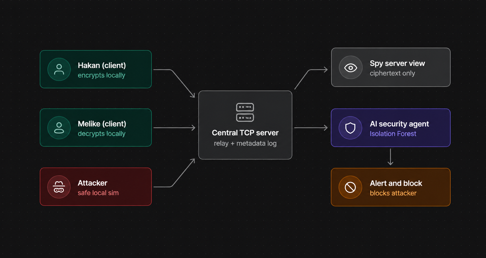
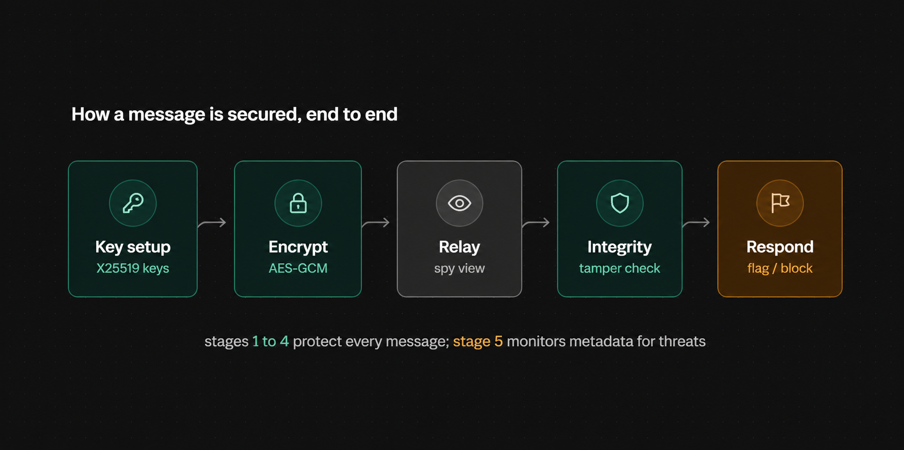

# End-to-End Encrypted Chat with AI-Based Anomaly Detection

**Course:** CENG3544 — Computer Network and Security
**Instructor:** Doç. Dr. Enis Karaarslan
**Student:** Hakan Kayacı
**Demo video:** https://youtu.be/we56pO28Ffw

## Overview

This project is a local, terminal-based chat application developed for the Computer and Network Security course. Two clients, Hakan and Melike, communicate through a central server. The application demonstrates the difference between unprotected and end-to-end encrypted communication, verifies message integrity, and applies a metadata-based anomaly detection mechanism that operates without reading message content. The system runs entirely on a single machine and performs no real attacks.

## System Architecture



*Figure 1. System architecture.*

The system consists of two clients and a central TCP server. The server relays messages, prints a spy-server view of what it can observe, logs connection metadata, and runs a security agent. The cryptographic operations, namely the X25519 key agreement and AES-256-GCM authenticated encryption, are performed entirely on the client side, so the derived key is never transmitted.



*Figure 2. Five-stage security flow of a message.*

## How It Works

- **Plain mode.** Clients exchange unencrypted text. The server's spy view prints the full message, showing that a relay can read all traffic when no protection is applied.
- **Encrypted mode.** Clients perform an X25519 key exchange through the server and derive a shared key locally. Each message is encrypted with AES-256-GCM, so the server observes only ciphertext.
- **Integrity verification.** AES-GCM authenticates every message. If a single bit of the ciphertext is modified, the receiver's verification fails and the message is rejected.
- **AI security agent.** A local agent inspects connection metadata only, such as message frequency, size, and reconnection count. It combines rule-based scoring with an Isolation Forest model to identify and temporarily block suspicious clients, without ever accessing the message content.

## Installation

Python 3.8 or newer is required.

```
pip install -r requirements.txt
```

The `cryptography` library provides X25519 and AES-GCM, and `scikit-learn` provides the Isolation Forest. If `scikit-learn` is not installed, the detector falls back to rule-based scoring.

## Running the Demonstration

Open four terminals in the project directory.

1. Start the server:

```
python server.py
```

2. Start the two clients in plain mode and send a message; the server prints it in clear text.

```
python client.py --name Hakan --peer Melike --mode plain
python client.py --name Melike --peer Hakan --mode plain
```

3. Stop both clients with `/quit` and restart them in encrypted mode. After the shared key is established, a sent message appears as ciphertext on the server and as plaintext only on the recipient.

```
python client.py --name Hakan --peer Melike --mode encrypted
python client.py --name Melike --peer Hakan --mode encrypted
```

4. Run the attacker simulation in a fourth terminal. The receiver displays an integrity warning, and the security agent marks the attacker as suspicious and blocks it temporarily; the legitimate clients are not affected.

```
python attacker_simulation.py
```

## Limitations

This is an educational prototype, not production security software. The design makes several deliberate trade-offs, grouped below by security property.

**Authentication and key exchange.** Public keys are relayed through the server without certificates or identity verification, so a malicious or compromised server could substitute the keys and perform a man-in-the-middle attack. There is no user authentication; a client may register under any name, which allows impersonation.

**Confidentiality and transport.** Only the message body is end-to-end encrypted. The transport is plain TCP, so metadata such as the communicating parties, timing, and message sizes remains visible, and plain mode transmits everything in clear text by design.

**Integrity and replay.** AES-GCM detects tampering of an individual message, but the system does not protect against replay attacks, because it uses no sequence numbers or timestamps. Message ordering and delivery are trusted to the server.

**AI-based anomaly detection.** The Isolation Forest is trained on a small synthetic baseline rather than real traffic, and its thresholds are tuned for demonstration, so on real traffic it may produce false positives or miss novel attacks. The temporary block is name-based and can therefore be bypassed.

**Availability.** The system provides no real protection against denial-of-service; the temporary block exists only for the demonstration.

**General.** The code has not been security-audited and is intended only for local, safe, educational use.

## Repository

Source code: https://github.com/hakankayaci/computer-network-security-final

---

# Türkçe

# Yapay Zekâ Tabanlı Anomali Tespitiyle Uçtan Uca Şifreli Sohbet

**Ders:** CENG3544 — Computer Network and Security
**Danışman:** Doç. Dr. Enis Karaarslan
**Öğrenci:** Hakan Kayacı
**Demo videosu:** https://youtu.be/we56pO28Ffw

## Genel Bakış

Bu proje, Bilgisayar ve Ağ Güvenliği dersi için geliştirilmiş, yerel ve terminal tabanlı bir sohbet uygulamasıdır. Hakan ve Melike adlı iki istemci, merkezi bir sunucu üzerinden haberleşir. Uygulama; korumasız iletişim ile uçtan uca şifreli iletişim arasındaki farkı gösterir, mesaj bütünlüğünü doğrular ve mesaj içeriğini okumadan yalnızca metadata üzerinden çalışan bir anomali tespit mekanizması uygular. Sistem tamamen tek bir makinede çalışır ve gerçek bir saldırı gerçekleştirmez.

## Sistem Mimarisi

Sistem, iki istemci ve merkezi bir TCP sunucusundan oluşur. Sunucu mesajları yönlendirir, gözlemleyebildiklerini bir casus sunucu görünümünde yazdırır, bağlantı metadatasını kaydeder ve bir güvenlik ajanı çalıştırır. Kriptografik işlemler, yani X25519 anahtar uzlaşımı ve AES-256-GCM kimlik doğrulamalı şifreleme, tamamen istemci tarafında yapılır; bu nedenle üretilen anahtar ağ üzerinden hiçbir zaman gönderilmez. İlgili şemalar Şekil 1 ve Şekil 2'de verilmiştir.

## Nasıl Çalışır

- **Düz mod.** İstemciler şifrelenmemiş metin gönderir. Sunucunun casus görünümü mesajın tamamını yazdırır; bu da koruma olmadığında aradaki sunucunun tüm trafiği okuyabildiğini gösterir.
- **Şifreli mod.** İstemciler sunucu üzerinden X25519 anahtar değişimi yapar ve ortak anahtarı yerel olarak türetir. Her mesaj AES-256-GCM ile şifrelenir, dolayısıyla sunucu yalnızca şifreli veriyi görür.
- **Bütünlük doğrulaması.** AES-GCM her mesajı kimlik açısından doğrular. Şifreli metnin tek bir biti değiştirilirse alıcının doğrulaması başarısız olur ve mesaj reddedilir.
- **Yapay zekâ güvenlik ajanı.** Yerel bir ajan yalnızca bağlantı metadatasını (mesaj sıklığı, boyut, yeniden bağlanma sayısı vb.) inceler. Kural tabanlı puanlamayı bir Isolation Forest modeliyle birleştirerek şüpheli istemcileri belirler ve geçici olarak engeller; mesaj içeriğine hiçbir zaman erişmez.

## Kurulum

Python 3.8 veya üzeri gerekir.

```
pip install -r requirements.txt
```

`cryptography` kütüphanesi X25519 ve AES-GCM sağlar, `scikit-learn` ise Isolation Forest sağlar. `scikit-learn` kurulu değilse, tespit mekanizması kural tabanlı puanlamaya geri döner.

## Demoyu Çalıştırma

Proje dizininde dört terminal açın.

1. Sunucuyu başlatın:

```
python server.py
```

2. İki istemciyi düz modda başlatıp bir mesaj gönderin; sunucu mesajı açık metin olarak yazdırır.

```
python client.py --name Hakan --peer Melike --mode plain
python client.py --name Melike --peer Hakan --mode plain
```

3. Her iki istemciyi `/quit` ile durdurup şifreli modda yeniden başlatın. Ortak anahtar kurulduktan sonra gönderilen bir mesaj sunucuda şifreli veri olarak, yalnızca alıcıda açık metin olarak görünür.

```
python client.py --name Hakan --peer Melike --mode encrypted
python client.py --name Melike --peer Hakan --mode encrypted
```

4. Dördüncü terminalde saldırgan simülasyonunu çalıştırın. Alıcı bir bütünlük uyarısı gösterir; güvenlik ajanı saldırganı şüpheli olarak işaretler ve geçici olarak engeller. Meşru istemciler bundan etkilenmez.

```
python attacker_simulation.py
```

## Kısıtlamalar

Bu, üretim amaçlı bir güvenlik yazılımı değil, eğitim amaçlı bir prototiptir. Tasarım, güvenlik özelliklerine göre aşağıda gruplanan bazı bilinçli ödünleşmeler içerir.

**Kimlik doğrulama ve anahtar değişimi.** Açık anahtarlar, sertifika veya kimlik doğrulaması olmadan sunucu üzerinden iletilir; bu nedenle kötü niyetli ya da ele geçirilmiş bir sunucu anahtarları değiştirip ortadaki adam (man-in-the-middle) saldırısı yapabilir. Kullanıcı kimlik doğrulaması yoktur; bir istemci herhangi bir isimle kayıt olabilir, bu da kimliğe bürünmeye olanak tanır.

**Gizlilik ve taşıma.** Yalnızca mesaj gövdesi uçtan uca şifrelenir. Taşıma katmanı düz TCP olduğundan, haberleşen taraflar, zamanlama ve mesaj boyutları gibi metadata görünür kalır; düz mod ise her şeyi tasarım gereği açık metin olarak iletir.

**Bütünlük ve yeniden gönderme (replay).** AES-GCM tek bir mesajın değiştirilmesini tespit eder, ancak sistem yeniden gönderme saldırılarına karşı koruma sağlamaz; çünkü sıra numarası veya zaman damgası kullanmaz. Mesaj sıralaması ve teslimi sunucuya emanet edilmiştir.

**Yapay zekâ tabanlı anomali tespiti.** Isolation Forest, gerçek trafik yerine küçük ve sentetik bir temel veriyle eğitilmiştir ve eşik değerleri demo için ayarlanmıştır; bu nedenle gerçek trafikte yanlış pozitif üretebilir veya yeni saldırıları kaçırabilir. Geçici engelleme isim tabanlıdır ve bu nedenle atlatılabilir.

**Erişilebilirlik.** Sistem, hizmet dışı bırakma (denial-of-service) saldırılarına karşı gerçek bir koruma sağlamaz; geçici engelleme yalnızca demo amaçlıdır.

**Genel.** Kod, güvenlik denetiminden geçmemiştir ve yalnızca yerel, güvenli ve eğitim amaçlı kullanım için tasarlanmıştır.

## Kaynak Kodu

Kaynak kodu: https://github.com/hakankayaci/computer-network-security-final
